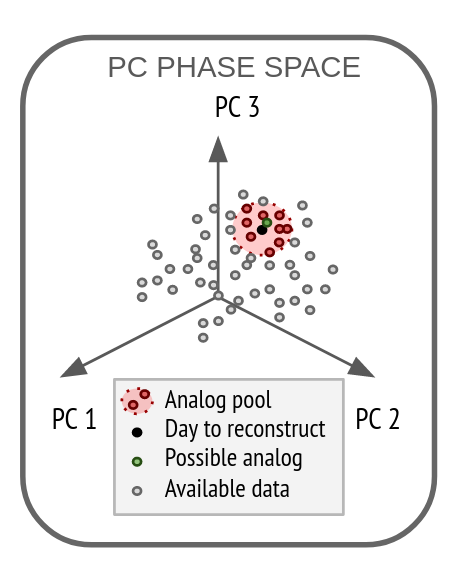

Tutorials
===================

In this section we will provide some tutorials with which you can make your first reconstruction. The `GitHub repository <https://github.com/alvaro-gc95/RASCAL>`_ contains some example data to practice with.
Int the repository you can also find an example of the folder structure to follow, to create your own reconstruction projects. The structure is as follows:

Prepare your data: Folder Structure
-------------------------------------

For RASCAL to work without unwanted surprises, it is necessary to organize the input data with the correct structure.

**1) OBSERVATIONAL DATA**

The observational data must follow this structure:

| /station_observations_directory/
| ├── /variable/
| │ ├── variable.csv
| │ ├── meta.csv

Where ``variable`` is the name of the variable to reconstruct (ex: TMEAN, PCP, WSPD ...)
and ``meta.csv`` is a .csv file that contains the columns [code, name, latitude, longitude, latitude]
The data must be in daily or sub-daily resolution.

.. note::
    **/station_observations_directory/** should be the same word as in the **code** variable in ``meta.csv``
    The ``variable.csv`` file should contain only the dates, and the data in a column named the same as the file.
   
   
An example of a variable file of mean temperature would be ``TMEAN.csv`` with the following format:

+-------------+---------------+
|             |     TMEAN     |
+=============+===============+
| 2005-01-01  |     -0.1      |
+-------------+---------------+
| 2005-01-02  |      1.2      |
+-------------+---------------+
|     ...     |      ...      |
+-------------+---------------+

An example of a ``meta.csv`` file would be:

+-------------+---------------+-------------+---------------+-------------+
|    code     |     name      |   latitude  |   longitude   |  altitude   |
+=============+===============+=============+===============+=============+
|    St03     |  Station 03   |   40.833588 |   -3.885217   |    1147     |
+-------------+---------------+-------------+---------------+-------------+

Therefore, in this case the folder structure would be as follows:

| /St03/
| ├── /TMEAN/
| │ ├── TMEAN.csv
| │ ├── meta.csv

**2) REANALYSIS DATA**

The reanalysis data must follow this structure:

| /reanalysis_directory/
| ├── /y_YYYY/
| │ ├── YYYY_level_variable.nc

Where ``YYYY`` is the year of the data,
``level`` the level of the variable and 
``variable`` the name of the predictor variable.
The reanalysis data can be in netCDF or GRIB format
The data must be in daily or sub-daily resolution

Make a your first reconstruction
------------------------------------

RASCAL is based in four main clases: Station, Predictor, Analogs and Rskill. After `installing the library <https://rascalv100.readthedocs.io/en/latest/installation.html#installation-via-pypi>`_, it can be imported as:

.. code-block:: python

   import rascal

**1) Get observational data**

   To load the observational data (in daily or sub-daily resolution) and the station metadata, the data is loaded from a CSV file with the same name as the desired variable, and a meta.csv file containing the name, code, altitude, longitude and latitude of the station. If you download the repository from `GitHub <https://github.com/alvaro-gc95/RASCAL>`_ , you can access the example observational data with the following code, for the variable **TMEAN**:

   .. code-block:: python
   
      observations_path = "./data/observations/St03/"
      station = rascal.analogs.Station(path=observations_apth)
      station_data = station.get_data(variable="TMEAN")

**2) Load and process predictor fields from large-scale models**

   .. warning::
       If you are using the `GitHub data <https://github.com/alvaro-gc95/RASCAL/tree/master/data>`_, the reanalysis directory is empty due to file size limitations. You can find the reanalysis data in `Zenodo <https://zenodo.org/records/10592595>`_ or you can use an already processed **Predictor** saved in ``./tmp/`` in `pickle <https://docs.python.org/3/library/pickle.html>`_ format, using the same parameters as in the code snippets of the tutorial. You can open it using this code:

       .. code-block:: python 
    
           import pickle 
       
           predictor_filename = "./tmp/925_Z-00hour_1D_mean-predictor.pkl"
           with open(predictor_filename, 'rb') as inp:
               predictors = pickle.load(inp)

   To load the reanalysis or large-scale model data we use the Predictor class. This example shows how to use the geopotential height at 925 hPa from files of sub-daily data of a full year, from 2005 to 2013, named as *2005_925_Z.nc, 2006_925_Z.nc, ... , 2013_925_Z.nc*. 
   
   .. code-block:: python
   
      # Get file paths
      years = [2005, 2006, 2007, 2008, 2009, 2010, 2011, 2012, 2013]
      reanalysis_path = "./data/reanalysis/ERA5/"
      predictor_variables = ["925_Z"]
      predictor_files = rascal.utils.get_files(
          nwp_path=reanalysis_path,
          variables=predictor_variables,
          dates=years,
          file_format=".nc"
      )

   
   After finding in the directory structure all the files, the data can be processed to prepare it. To obtain a daily value, we select only the 00:00 hour of each day through ``grouping == 00h_1D_mean``. Other hours of the days can be selected subsituting ``00h`` by the desired hour in a 23h format. It is also possible to use the mean, median, maximum or minimum values of the day, instead of a particular hour, by deleting the hour from the argument string and using ``1D_mean``, ``1D_median``, ``1D_max``, or ``1D_min`` instead. If you want to use predictors of a lower temporal frequency you can make monthly or yearly predictors by substituting ``1D`` by ``1m``, ``1Y``.
   
    .. note::

       Although is possible to use monthly or yearly predictors, our recommendation is to stick to daily predictors and later upscale the daily time series reconstructions to monthly or yearly series, since using the daily predictors allows to have a lot more variety of candidates in the analog pool that a smaller dataset of monthly or yearly data. 
   

   A smaller domain than the original dataset can be selected. to see how different domain sizes or regions can affect the reconstruction process. In this case the selected domain is *50ºN-30ºN, 30ºW-5ºE*. 

   .. code-block:: python
   
      # Generate Predictor
      predictors = rascal.analogs.Predictor(
         paths=predictor_files,
         grouping='00h_1D_mean',
         lat_min=30,
         lat_max=50,
         lon_min=-30,
         lon_max=5
     )
     
If you want to use more than one meteorological variable, or the predictor variable is vectorial and have U and V components, you can include all the data in a single cmpund variable using the ``mosaic`` argument. If ``mosaic == True``, **Predictor** concatenates both components U and V in the longitude axis to obtain a single compound variable of size *(time x 2*longitude x latitude)*:
     
    .. code-block:: python
   
      # Example with an hypothetical wind at 925 hPa
   
      # Get file paths
      years = [2005, 2006, 2007, 2008, 2009, 2010, 2011, 2012, 2013]
      reanalysis_path = "./data/reanalysis/ERA5/"
      predictor_variables = ["925_U", "925_V"]
      predictor_files = rascal.utils.get_files(
          nwp_path=reanalysis_path,
          variables=predictor_variables,
          dates=years,
          file_format=".nc"
      )

      # Generate Predictor
      predictors = rascal.analogs.Predictor(
         paths=predictor_files,
         grouping='00h_1D_mean',
         lat_min=30,
         lat_max=50,
         lon_min=-30,
         lon_max=5,
         mosaic=True
     )

**3) Perform Principal Component Analysis on the predictor fields**

   After selecting the predictor variable, its signal is decomposed in spatial and temporal patterns using :ref:`PCA`. The obtained time series (PCs) are the true predictor of this method, since this values are the ones that we are going to use to make the reconstructions.
   The Principal Component Analysis (PCA) of the predictor variable standardized seasonal anomalies, with 4 principal components and for the conventional seasons Winter (DJF), Spring (MAM), Summer (JJA), and Fall (SON),  can be calculated as follows:
   
   .. code-block:: python
   
      predictor_pcs = predictors.pcs(
         npcs=n_components,
         seasons=[[12, 1, 2], [3, 4, 5], [6, 7, 8], [9, 10, 11]],
         standardize=True,
         path="./tmp/"
      )
      
   The PCA solver is saved as a `pickle <https://docs.python.org/3/library/pickle.html>`_ in the selected path, ``./tmp/`` in this case. So if you want to make a reconstruction changing parameters, you can load the solver instead of calculate it again as:
   
   .. code-block:: python  
   
      import pickle 
      
      pcs_filename = "./tmp/925_Z-04-1-PCS.pkl"
      with open(pcs_filename, 'rb') as inp:
          predictor_pcs = pickle.load(inp)

**4) Look at the PC space to find analog days in the historical data**

   After performing the :ref:`PCA`, the obtained values of the PCs act as the predictor used to perform the reconstructions. The next step is to create a pool of the most possible analog candidates. The **Analogs** class takes the days to reconstruct, from 01-01-2012 to 31-12-2012 in this case, and look at the euclidean distance in the PCs space.

   .. code-block:: python
   
      import datetime
      import pandas as pd
   
      # Reconstruction period
      reconstruction_dates = pd.date_range(
          start=datetime.datetime(2012, 1, 1),
          end=datetime.datetime(2012, 12, 31),
          freq='1D'
      )
   
      analogs = rascal.analogs.Analogs(
          pcs=predictor_pcs, 
          observations=station_data, 
          dates=reconstruction_dates
      )

  
**5) Reconstruct or extend missing observational data**

   After calculating the distances of all the days to each day to reconstruct, a pool of the N closest days in the PCs space is selected, setting ``pool_size = N`` in the ``Analogs.reconstruct()`` class method, where **N <= days in PCs**. To select the best analog, you can choose between three different similarity methods: ``closest``, ``average``, or ``quantilemap``.
   
   The **closest** method selects the day with the smaller euclidean distace in the PCs space:

   .. code-block:: python

      reconstruction = analogs.reconstruct(
          pool_size=30,
          method='closest'
          )
          
   .. image:: 
      ../images/closest.png
      
   The **average** method takes the *M* days with the smaller distance in the pool, and averages them, weighting them by the inverse of the square root of the distance:
   
   .. code-block:: python

      m = 10
      reconstruction = analogs.reconstruct(
          pool_size=30,
          method='average',
          sample_size=m
          )
          
   .. image:: 
      ../images/average.png
      
   The **quantilemap** method requires of another *mapping variable*, a variable highly correlated to the predictand variable, and calculates its quantile in its distribution in the analog pool,
   then it chooses the day which its historical data occupies the same quantile in the pool distribution as the mapping variable. In this case we used the 2m temperature of the reanalysis ("SURF_T").

   .. code-block:: python

      # Get file paths
      years = [2005, 2006, 2007, 2008, 2009, 2010, 2011, 2012, 2013]
      reanalysis_path = "./data/reanalysis/ERA5/"
      mapping_variable_name = ["SURF_T"]
      predictor_files = rascal.utils.get_files(
          nwp_path=reanalysis_path,
          variables=mapping_variable_name,
          dates=years,
          file_format=".nc"
      )

      # Predictor class of the mapping variable
      mapping_variable = rascal.analogs.Predictor(
         paths=predictor_files,
         grouping='00h_1D_mean',
         lat_min=30,
         lat_max=50,
         lon_min=-30,
         lon_max=5
      )
      reconstruction = analogs.reconstruct(
          pool_size=30,
          method='quantilemap',
          mapping_variable=mapping_variable
       )
          
   .. image:: 
      ../images/quantiles.png
      
.. note::
    The mapping variable can be the same variable as the predictand but from the reanalysis. This method allows to remove the bias of the reanalysis and to consider local phenomena seen in the observations that the reanalysis cannot resolve.
        
    Other variables can be used as long as they are highly correlated, and sometimes it can give better results than using the same variable as the predictand, if that variable is badly resolved in the reanalysis.
    
    
Validate your reconstructions
--------------------------------

When looking for analog days, it is possible that the days with the most similar large-scale patterns are day few days before or after the date to reconstruct, due to atmospheric persistence effects. To see how well the method perform without the influence of persistence effects, while also creating a *testing-training* period split, is to use validation windows.
For each day to be reconstructed, you can omit from the pool the N days before and/or after it. This way, you do not consider these days in the reconstruction, while reconstructing a day with a dataset "independent" of the period to be reconstructed.
This is implemented in ``Analogs.reconstruct()`` using the ``vw_size`` and ``vw_type`` arguments. Where ``vw_size`` determines the total number of days to discard around the day to be reconstructed, and ``vw_type`` determines the type of gap, omitting the days before if ``vw_type = 'forward'``, the days after if ``vw_type = 'backward'``, and the half days before and half days after if ``vw_type = 'centered'``.
For example, the last part of the last code snippet can be validated using a centered window of 30 days using:

   .. code-block:: python

      reconstruction = analogs.reconstruct(
          pool_size=30,
          method='quantilemap',
          mapping_variable=mapping_variable,
          vw_size=30,
          vw_type='centered'
       )
          

